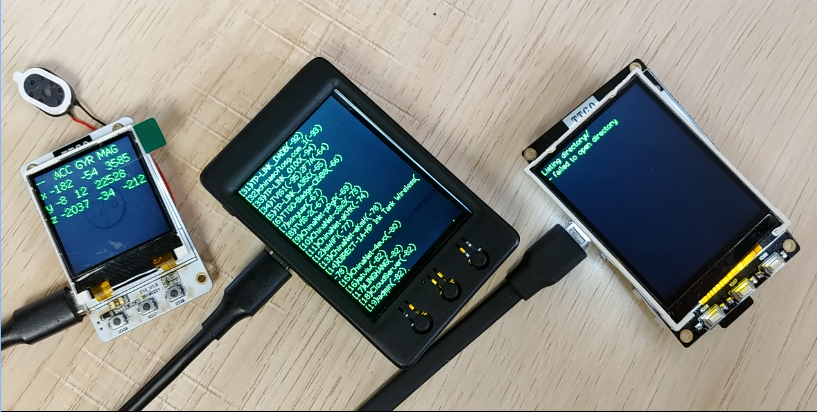
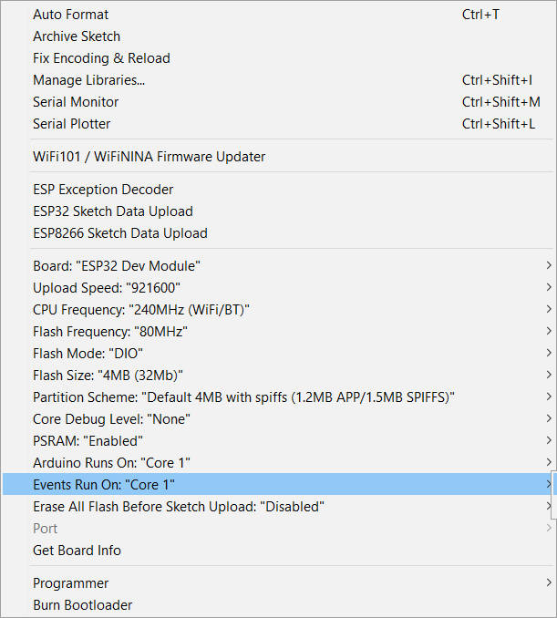

# TTGO T10 & T4 TEST CODE

# [中文](./README_CN.Md) | EN



# Quick Start

1. Install `TFT_eSPI` from the Arduino library installation manager
2. Copy the `Buttons` in the `LilyGo_Txx/lib` directory to the `<C:\Users\UserName\Documents\Arduino\libraries>` directory
3. Enter `<C:\Users\UserName\Documents\Arduino\libraries\TFT_eSPI>` to change the configuration file. For different types of boards, you need to enable the corresponding `TFT_eSPI` setting (select the corresponding pin of the LCD screen).

#### **T4 V1.3**

- Open `User_Setup_Select.h` in the `TFT_eSPI` directory and disable it by `#include <User_Setup.h>`.
- Uncomment the `#include <User_Setups/Setup22_TTGO_T4_v1.3.h>` line

#### **T4 V1.2**

- Open `User_Setup_Select.h` in the `TFT_eSPI` directory and disable it by `#include <User_Setup.h>`.
- Uncomment the `#include <User_Setups/Setup22_TTGO_T4.h>` line

#### **TS V2.0 1.4 Inc'**

- Copy `User_Setups/T10_V20_1C4.h` in the `LilyGo_Txx` folder to the `TFT_eSPI\User_Setups` directory
- Open `User_Setup_Select.h` in the `TFT_eSPI` directory, disable `#include <User_Setup.h>`, add `#include <User_Setups/T10_V20_1C4.h' below the line `#include <User_Setup.h>` >`

#### **TS V2.0 1.8 Inc'**

- Copy `User_Setups/T10_V20_1C8.h` in the `LilyGo_Txx` folder to the `TFT_eSPI\User_Setups` directory
- Open `User_Setup_Select.h` in the `TFT_eSPI` directory, disable `#include <User_Setup.h>`, add `#include <User_Setups/T10_V20_1C8.h below the line `#include <User_Setup.h>` >`

3. Open `LilyGo_Txx/LilyGo_Txx.ino`, above the sketch, uncomment the corresponding board, it looks as follows
   
    ```
    // #define T4_ V12       //Historical version
    // #define T4_ V13       //Version for sale
    // #define T10_ V14      //Historical version
    // #define T10_ V18      //Version for sale  TS V1.8
    // #define T10_ V20      //Version for sale  TS V2.0
    ```

4. Select the board according to the following options
     1. `Board` -> `ESP32` -> `ESP32 Dev Module`
     2. `PSRAM` -> `Enable` (if it is TS, you need to select Disable here)
     3. `Flash Size` -> `4MB(32Mb)`
     4. `Flash Mode` -> `DIO`
     5. Some other options are filled in according to the actual situation, and the selection is as shown in the figure below
         


5. Click the right arrow above `Arduino IDE` to compile and upload (please make sure to install the [serial driver](https://www.wch.cn/downloads/CH343SER_EXE.html) and connect the board to the computer via USB)

## T10 pin map

| Name        | V18/V20 |
| ----------- | ------- |
| TFT Driver  | ST7735  |
| TFT_MISO    | N/A     |
| TFT_MOSI    | 23      |
| TFT_SCLK    | 5       |
| TFT_CS      | 16      |
| TFT_DC      | 17      |
| TFT_RST     | N/A     |
| TFT_BL      | 27      |
| SD_MISO     | 2       |
| SD_MOSI     | 15      |
| SD_SCLK     | 14      |
| SD_CS       | 13      |
| I2C_SDA     | 21      |
| I2C_SCL     | 22      |
| SPEAKER_OUT | 25      |
| ADC_IN      | 35      |
| BUTTON1     | 36      |
| BUTTON2     | 37      |
| BUTTON3     | 39      |

## T4  pin map

| Name        | V12     | V13     |
| ----------- | ------- | ------- |
| TFT Driver  | ILI9341 | ILI9341 |
| TFT_MISO    | 12      | 12      |
| TFT_MOSI    | 23      | 23      |
| TFT_SCLK    | 18      | 18      |
| TFT_CS      | 27      | 27      |
| TFT_DC      | 26      | 32      |
| TFT_RST     | 5       | 5       |
| TFT_BL      | N/A     | 4       |
| SD_MISO     | 2       | 2       |
| SD_MOSI     | 15      | 15      |
| SD_SCLK     | 14      | 14      |
| SD_CS       | 13      | 13      |
| Button 0    | 14      | 14      |
| Button 1    | 5       | 5       |
| Button 2    | 27      | 27      |
| Button 3    | 25      | 25      |
| SPEAKER PWD | N/A     | 19      |
| SPEAKER OUT | N/A     | 25      |
| I2C_SDA     | 21      | 21      |
| I2C_SCL     | 22      | 22      |
